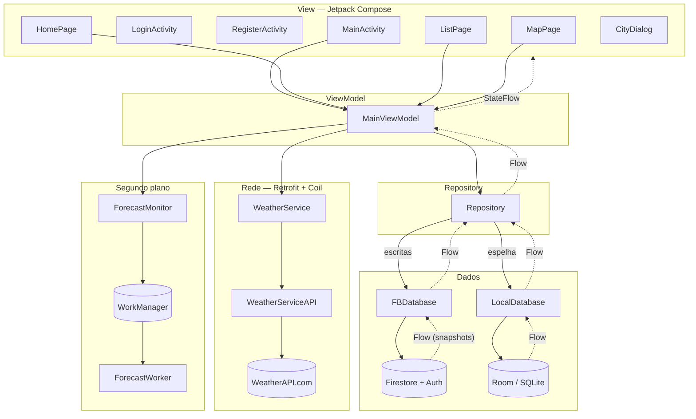

# WeatherApp

Aplicativo Android de previsão do tempo, escrito em **Kotlin** com UI em **Jetpack Compose**.
Projeto acadêmico da disciplina de **Programação para Dispositivos Móveis (PDM)** — TADS, IFPE (Prof. Ramide Dantas).

O usuário se cadastra, monta uma lista de cidades favoritas (digitando o nome ou clicando no mapa) e vê a previsão do tempo de cada uma. Os favoritos ficam no **Firestore** (nuvem, por usuário), são espelhados no **Room** (banco local, funciona offline) e podem ser **monitorados em segundo plano**, gerando notificações periódicas.

---

## 1. Visão geral

Três telas, acessíveis pela barra de navegação inferior:

| Tela | O que faz |
| :--- | :--- |
| **Início** (`HomePage`) | Previsão de vários dias da cidade selecionada. |
| **Favoritos** (`ListPage`) | Lista as cidades salvas: ícone do tempo, nome, condição atual, indicador de monitoramento e botão de remover. |
| **Mapa** (`MapPage`) | Google Maps; clicar no mapa adiciona uma cidade. |

Detalhe das duas formas de adicionar cidade:

- **Por nome** (FAB → diálogo): o app consulta a API para descobrir as **coordenadas**.
- **Por clique no mapa**: o app consulta a API para descobrir o **nome** da cidade.

Em ambos os casos, só depois de resolver o dado que falta a cidade é gravada no Firebase.

---

## 2. Arquitetura

Padrão **MVVM com Repository**. O ponto central é o `Repository`: ele une o banco remoto (Firestore) e o local (Room), e expõe as cidades como um `Flow`. A UI **nunca** lê o Firestore diretamente — ela lê o Room, que o Repository mantém atualizado.



### Camadas

| Camada | Pacote | Responsabilidade |
| :--- | :--- | :--- |
| **View** | `com.weatherapp` / `.ui` | Activities e telas Compose. Observam `StateFlow` e recompõem. |
| **ViewModel** | `MainViewModel` | Estado da UI, cache de clima/previsão, orquestra Repository + rede + monitor. |
| **Repository** | `.repo` | Fonte única de verdade das cidades. Sincroniza Firestore → Room. |
| **Rede** | `.api` | Retrofit + Coil, acesso à WeatherAPI.com. Funções `suspend`. |
| **Dados remotos** | `.db.fb` | Firestore + Auth, expostos como `Flow`. |
| **Dados locais** | `.db.local` | Room (`LocalCity`, DAO, `LocalDatabase`). |
| **Segundo plano** | `.monitor` | WorkManager + notificações. |
| **Domínio** | `.model` | `City`, `User`, `Weather`, `Forecast` — Kotlin puro. |

### Sincronização Firestore → Room (o coração do Repository)

No `init`, o `Repository` coleta o `Flow` de cidades do Firestore e faz o **diff** contra o último estado conhecido:

```kotlin
val deletedCities = cityMap.filter { it.key !in nameList }
val updatedCities = cityList.filter { it.name in cityMap.keys }
val newCities     = cityList.filter { it.name !in cityMap.keys }
```

Só as diferenças vão para o Room (`insert`/`update`/`delete`) — evita reescrever a base inteira a cada snapshot. As **escritas** seguem o caminho oposto: `add`/`remove`/`update` vão direto para o Firebase, e a mudança volta pela sincronização.

Cada usuário tem seu próprio banco Room: o nome do arquivo é o `uid` do Firebase (`LocalDatabase(this, uid)` em `MainActivity`).

### Assincronismo

Tudo é **coroutines + Flow** (não há mais callbacks):

- `WeatherService` expõe funções `suspend` com `withContext(Dispatchers.IO)`.
- `FBDatabase` converte os `snapshots()` do Firestore em `Flow`.
- O DAO do Room retorna `Flow<List<LocalCity>>`.
- O `MainViewModel` converte tudo em `StateFlow` com `stateIn(viewModelScope, SharingStarted.Lazily, ...)`.
- As telas consomem com `collectAsStateWithLifecycle`.

### Navegação dirigida por estado

A aba atual vive em `viewModel.page`. A `BottomNavBar` apenas **atualiza** `page`; um `LaunchedEffect(viewModel.page)` na `MainActivity` executa a navegação de fato. Assim qualquer parte do app troca de tela mexendo no estado — por exemplo, clicar numa cidade na lista define `city` e `page = Route.Home`, ou tocar numa notificação (`onNewIntent`) abre a Home já na cidade certa.

---

## 3. Funcionalidades

- **Autenticação** (Firebase Auth): cadastro, login por e-mail/senha, sessão persistente e logout. O roteamento entre login e app é global, feito por um `AuthStateListener` em `WeatherApp.kt`.
- **Favoritar cidades** por nome (API resolve as coordenadas) ou por clique no mapa (API resolve o nome).
- **Clima atual e previsão de até 10 dias**, com cache em memória por cidade no ViewModel e estados `Weather.LOADING` / `Weather.ERROR`.
- **Ícones reais do tempo** carregados por URL com Coil (`AsyncImage` nas telas, `getBitmap` para marcadores), com `loading.png` de fallback.
- **Persistência em nuvem + offline**: Firestore em `/users/{uid}/cities`, espelhado em Room. Como a UI lê o Room, a lista aparece mesmo sem rede.
- **Sincronização em tempo real** entre dispositivos via snapshots do Firestore.
- **Monitoramento de cidades** (`isMonitored`): cidades marcadas geram um `PeriodicWorkRequest` a cada 15 min; o `ForecastWorker` emite uma notificação que, ao ser tocada, abre o app já na cidade correspondente.
- **Google Maps** integrado, com localização do dispositivo quando a permissão é concedida.
- **Permissões em runtime**: `ACCESS_FINE_LOCATION` e, no Android 13+, `POST_NOTIFICATIONS`.

---

## 4. Estrutura de pacotes

Código em `app/src/main/java/com/weatherapp/`.

```
com/weatherapp/
│
├── WeatherApp.kt            # Application: AuthStateListener global (login ↔ main)
├── MainActivity.kt          # Monta as dependências, Scaffold, NavHost, permissões
├── LoginActivity.kt         # Login por e-mail/senha
├── RegisterActivity.kt      # Cadastro de usuário
├── MainViewModel.kt         # ViewModel + Factory
│
├── repo/
│   └── Repository.kt        # Firestore → Room (diff) + escritas
│
├── api/                     # REDE (Retrofit + Coil)
│   ├── WeatherService.kt    # getName, getLocation, getWeather, getForecast, getBitmap
│   ├── WeatherServiceAPI.kt # Endpoints: search / current / forecast
│   ├── APILocation.kt       # Resposta de busca (nome, lat, lon)
│   ├── APICurrentWeather.kt # Clima atual + toWeather()
│   ├── APIWeatherForecast.kt# Previsão + toForecast()
│   ├── APIWeather.kt        # Temperatura e condição
│   └── APICondition.kt      # Texto e ícone da condição
│
├── db/
│   ├── fb/                  # FIREBASE
│   │   ├── FBDatabase.kt    # Auth + Firestore, expõe Flows
│   │   ├── FBCity.kt        # name, lat, lng, monitored (+ conversões)
│   │   └── FBUser.kt        # name, email (+ conversões)
│   └── local/               # ROOM
│       ├── LocalCity.kt     # @Entity (PK = name) + conversões
│       ├── LocalCityDAO.kt  # @Upsert / @Delete / getCities(): Flow
│       ├── LocalRoomDatabase.kt
│       └── LocalDatabase.kt # Wrapper com CoroutineScope de IO
│
├── monitor/                 # SEGUNDO PLANO
│   ├── ForecastMonitor.kt   # Agenda/cancela work periódico por cidade
│   └── ForecastWorker.kt    # Worker que emite a notificação
│
├── model/                   # DOMÍNIO
│   ├── City.kt              # name, location (LatLng?), isMonitored
│   ├── User.kt              # name, email
│   ├── Weather.kt           # date, desc, temp, imgUrl, bitmap + LOADING/ERROR
│   └── Forecast.kt          # date, weather, tempMin, tempMax, imgUrl
│
└── ui/
    ├── HomePage.kt          # Previsão da cidade selecionada
    ├── ListPage.kt          # Lista de favoritos
    ├── MapPage.kt           # Google Maps + adicionar por clique
    ├── CityDialog.kt        # Diálogo de adicionar por nome
    ├── nav/                 # Route, BottomNavItem, BottomNavBar, MainNavHost
    └── theme/               # Cores, tipografia, Material 3
```

---

## 5. Classes principais

### `MainViewModel`

```kotlin
class MainViewModel(
    private val repo: Repository,
    private val service: WeatherService,
    private val monitor: ForecastMonitor
) : ViewModel()
```

**Estado exposto**

| Propriedade | Tipo | Descrição |
| :--- | :--- | :--- |
| `cities` | `StateFlow<Map<String, City>>` | Favoritos vindos do Room, indexados por nome. |
| `user` | `StateFlow<User?>` | Perfil do usuário logado. |
| `weather` | `Flow<Map<String, Weather>>` | Cache de clima atual por cidade. |
| `forecast` | `Flow<Map<String, List<Forecast>?>>` | Cache de previsão por cidade. |
| `city` | `String?` | Cidade exibida na Home (estado Compose). |
| `page` | `Route` | Aba atual (estado Compose). |

**Funções**

- `addCity(name)` / `addCity(location)` — resolvem o dado faltante na API e gravam via `repo.add`.
- `remove(city)` — remove do Firebase e cancela o monitoramento.
- `update(city)` — atualiza no Firebase e reagenda o monitoramento.
- `loadWeather(name)` / `loadForecast(name)` — carregam sob demanda, só se ainda não estiverem em cache; usam `runCatching` e caem em `Weather.ERROR` / `null` em caso de falha.
- `loadBitmap(name)` — baixa o ícone via Coil e atualiza o `Weather` em cache (usado nos marcadores do mapa).

### `Repository`

`cities: Flow<List<City>>` (do Room) e `user: Flow<User>` (do Firestore); `add`, `remove`, `update` escrevem no Firebase. O `init` faz a sincronização por diff descrita na seção 2.

### `WeatherService`

Cria o Retrofit (Gson) e um `ImageLoader` do Coil. Funções `suspend`: `getName(lat,lng)`, `getLocation(name)`, `getWeather(name)`, `getForecast(name)`, `getBitmap(url)`. A chave da API é injetada nos endpoints via `BuildConfig.WEATHER_API_KEY`.

### `FBDatabase`

`user` e `cities` são `Flow` construídos a partir de `snapshots()` do Firestore (coleção `/users/{uid}/cities`). Métodos: `register`, `add`, `remove`, `update`. Lança exceção se não houver usuário logado.

### `ForecastMonitor` / `ForecastWorker`

`updateCity(city)` cancela o trabalho anterior e, se `city.isMonitored`, enfileira um `PeriodicWorkRequest` único (chave = nome da cidade, intervalo de 15 min, delay inicial de 10 s). O `ForecastWorker` cria o canal `WEATHER_APP` e publica uma notificação com `PendingIntent` para a `MainActivity` levando o extra `"city"` — capturado pelo `addOnNewIntentListener` da `MainActivity`.

---

## 6. Fluxos

### Adicionar cidade

```
FAB → CityDialog → addCity(name)          Mapa → onMapClick → addCity(latLng)
        │                                          │
        ▼                                          ▼
 service.getLocation(name)                  service.getName(lat,lng)
        │                                          │
        └──────────────► repo.add(City) ◄──────────┘
                              │
                         FBDatabase → Firestore
                              │  (snapshot)
                         Repository (diff) → Room
                              │  (Flow)
                         MainViewModel → telas recompõem
```

### Exibir clima e previsão

1. A tela dispara `loadWeather(name)` / `loadForecast(name)` num `LaunchedEffect`.
2. Se já houver cache, retorna imediato; senão marca `Weather.LOADING` e chama a API.
3. A resposta é convertida (`toWeather()` / `toForecast()`), entra no cache e a tela recompõe.
4. `loadBitmap` baixa o ícone via Coil para uso nos marcadores.

### Autenticação

`WeatherApp.onCreate` registra um `AuthStateListener` que vale para todo o processo:

- sem sessão → `LoginActivity` (pilha limpa);
- com sessão → `MainActivity`;
- `signOut()` na TopAppBar → volta ao login automaticamente.

No cadastro, após `createUserWithEmailAndPassword`, o perfil é gravado com `FBDatabase().register(...)` e o login automático dispara a ida para a `MainActivity`.

### Notificação de cidade monitorada

`update(city)` com `isMonitored = true` → `ForecastMonitor` agenda o worker → a cada ciclo o `ForecastWorker` notifica → o toque abre a `MainActivity`, que define `viewModel.city` e `viewModel.page = Route.Home`.

---

## 7. Dependências

Catálogo em [gradle/libs.versions.toml](gradle/libs.versions.toml), uso em [app/build.gradle.kts](app/build.gradle.kts).

| Biblioteca | Uso |
| :--- | :--- |
| **Retrofit 2** + **Converter Gson** (3.0.0) | Cliente HTTP e parsing do JSON da WeatherAPI. |
| **Coil Compose** (2.7.0) | Ícones do tempo por URL (`AsyncImage`, `ImageLoader`). |
| **Firebase Auth / Firestore** | Contas e banco em nuvem com sincronização em tempo real. |
| **Room** (runtime, ktx, compiler via KSP) | Banco local, cache offline das cidades. |
| **WorkManager** (2.10.0) | Monitoramento periódico em segundo plano. |
| **Google Maps SDK** (20.0.0) + **Maps Compose** (8.3.0) | Mapa e marcadores. |
| **Play Services Location** (21.3.0) | Localização do dispositivo. |
| **Navigation Compose** (2.9.8) + **kotlinx-serialization** (1.11.0) | Rotas type-safe. |
| **Lifecycle ViewModel/Runtime Compose** | `viewModel()`, `collectAsStateWithLifecycle`. |
| **Material 3** + **Material Icons Extended** | Componentes e ícones. |

---

## 8. Configuração e execução

**Pré-requisitos:** Android Studio atualizado, **JDK 21**, `minSdk 30` (dispositivo físico ou emulador).

**1. Firebase**
1. Crie um projeto no [Firebase Console](https://console.firebase.google.com/) e adicione um app Android com o pacote `com.weatherapp`.
2. Baixe o `google-services.json` para `app/google-services.json`.
3. Ative **Authentication** (provedor E-mail/Senha) e **Cloud Firestore**.

**2. Chaves de API** — no `local.properties` da raiz (não versionado):

```properties
MAPS_API_KEY="SUA_CHAVE_DO_GOOGLE_MAPS"
WEATHER_API_KEY="SUA_CHAVE_DA_WEATHERAPI"
```

- `MAPS_API_KEY`: **Maps SDK for Android** ([Google Cloud Console](https://console.cloud.google.com/)), lida pelo `secrets-gradle-plugin` e injetada no manifesto.
- `WEATHER_API_KEY`: [WeatherAPI.com](https://www.weatherapi.com/), exposta como `BuildConfig.WEATHER_API_KEY`.

> O build **falha** se o `local.properties` não existir ou não tiver `WEATHER_API_KEY` — ele é lido em tempo de configuração no `app/build.gradle.kts`.

**3. Executar**

```bash
./gradlew installDebug     # ou Run (▶) no Android Studio
```

Após mexer em `build.gradle.kts`, faça **Build → Clean Project** (só o sync pode não bastar).
