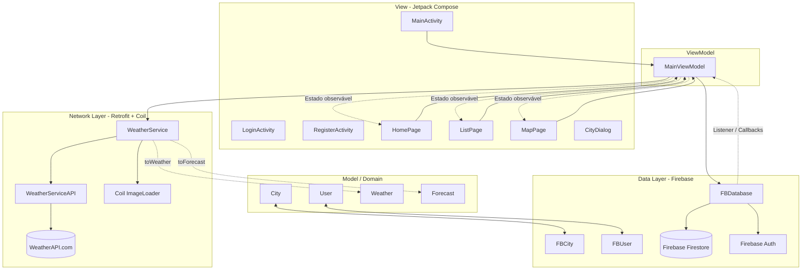

# WeatherApp - Documentação Oficial do Projeto

Projeto acadêmico desenvolvido na disciplina de **Programação para Dispositivos Móveis (PDM)** — TADS, IFPE (Prof. Ramide Dantas). O **WeatherApp** é um aplicativo Android escrito em **Kotlin** com interface inteiramente em **Jetpack Compose**. Ele usa o **Firebase** para autenticação e banco de dados em nuvem, o **Google Maps** para gerenciar cidades geograficamente, a **[WeatherAPI.com](https://www.weatherapi.com/)** (via **Retrofit**) para obter clima atual e previsão do tempo, e o **Coil** para carregar os ícones do tempo a partir de URLs.

---

## 1. Visão Geral

O usuário se cadastra/loga e monta uma lista de cidades favoritas — digitando o nome (em um diálogo) ou clicando em um ponto do mapa. Para cada cidade, o app exibe o **clima atual** e a **previsão de vários dias**, obtidos em tempo real da WeatherAPI.com. A lista de cidades de cada usuário é persistida no **Cloud Firestore** e sincronizada em tempo real entre os dispositivos.

O app tem três telas principais, acessíveis por uma barra de navegação inferior:
- **Início (Home)**: mostra o clima atual e a previsão da cidade selecionada, com os ícones reais do tempo.
- **Favoritos (List)**: lista as cidades salvas; permite selecionar (abre na Home) ou remover.
- **Mapa (Map)**: exibe marcadores das cidades favoritas (com o ícone do tempo) e permite adicionar novas clicando no mapa.

Um detalhe importante das práticas de rede: **ao adicionar por nome, o app busca as coordenadas pela API**; **ao adicionar por clique no mapa, o app busca o nome da cidade pela API** — só então a cidade é salva no Firebase.

A navegação entre as telas é **dirigida por estado**: a aba atual fica em `MainViewModel.page`, o que permite, por exemplo, que clicar numa cidade na lista a selecione e leve automaticamente para a Home.

---

## 2. Arquitetura

O projeto adota o padrão **MVVM (Model-View-ViewModel)**. A novidade em relação às primeiras versões é a **camada de rede** (`api/`), que isola o acesso à WeatherAPI.com. O `MainViewModel` é a fonte única de verdade: a UI lê seu estado observável e dispara eventos; ele orquestra a rede (`WeatherService`) e o banco (`FBDatabase`).



### Camadas

1. **Model (domínio)** — pacote `com.weatherapp.model`. Objetos de dados puros usados pela UI: `City`, `User`, `Weather`, `Forecast`.
2. **View (UI)** — Jetpack Compose. Activities (`MainActivity`, `LoginActivity`, `RegisterActivity`) e páginas (`HomePage`, `ListPage`, `MapPage`, `CityDialog`). Observa o estado do ViewModel e recompõe a tela a cada mudança.
3. **ViewModel** — `MainViewModel`. Mantém o estado (cidades, usuário, clima, previsão, cidade/aba selecionada) com `State` do Compose, orquestra rede e banco, e implementa `FBDatabase.Listener`. A aba ativa fica em `page`, o que torna a navegação dirigida por estado.
4. **Network (rede)** — pacote `com.weatherapp.api`. `WeatherService` + `WeatherServiceAPI` (Retrofit) acessam a WeatherAPI.com. Classes `API*` modelam a resposta JSON, com funções `toWeather()`/`toForecast()` que convertem para o domínio. O `WeatherService` também usa o **Coil** (`getBitmap`) para baixar os ícones do tempo a partir de URLs.
5. **Data (persistência)** — pacote `com.weatherapp.db.fb`. `FBDatabase` abstrai Firestore + Auth e escuta mudanças em tempo real; `FBCity`/`FBUser` serializam documentos.

### Conversões entre modelos
- **API → domínio**: `APICurrentWeather.toWeather()`, `APIWeatherForecast.toForecast()`
- **Domínio ↔ Firebase**: `City.toFBCity()` / `FBCity.toCity()`, `User.toFBUser()` / `FBUser.toUser()`

### Fluxos de dados
- **Reativo (banco → UI)**: mudanças no Firestore disparam o `addSnapshotListener` em `FBDatabase`, que notifica o `MainViewModel` (`onCityAdded/Updated/Removed`). O ViewModel altera seu estado e as telas recompõem automaticamente.
- **Ação (UI → banco)**: o usuário interage (adicionar/remover) → o ViewModel consulta a **API** quando necessário (coordenadas ou nome) e então grava/apaga via `FBDatabase`.
- **Clima sob demanda**: ao exibir uma cidade, a UI chama `viewModel.weather(name)` / `viewModel.forecast(name)`; o ViewModel carrega da API uma única vez e mantém em cache de memória. Ao receber o clima atual, ele ainda baixa o **bitmap do ícone** (via Coil) para usar nos marcadores do mapa.
- **Navegação por estado**: a aba atual fica em `viewModel.page`. A `BottomNavBar` apenas atualiza `page`, e a `MainActivity` reage com um `LaunchedEffect(page)` que executa a navegação. Assim, qualquer parte do app (ex.: selecionar cidade na lista) pode trocar de tela alterando `page`.

---

## 3. Funcionalidades

- **Autenticação de usuários** (Firebase Auth): login por e-mail/senha, cadastro com validação local (senha repetida), sessão persistente e logout.
- **Favoritar cidades**:
  - **Por nome** (diálogo): a API resolve as coordenadas (`addCity(name)`).
  - **Pelo mapa** (clique): a API resolve o nome da cidade (`addCity(location)`).
- **Clima atual e previsão**: para cada cidade, busca na WeatherAPI a condição atual (temperatura, descrição, ícone) e a previsão de vários dias (mín/máx, condição), com cache em memória.
- **Ícones reais do tempo**: carregados das URLs da API com **Coil** (`AsyncImage` nas telas; `getBitmap` para os marcadores do mapa), com `loading.png` como imagem de fallback.
- **Sincronização em tempo real**: cidades salvas em `/users/{uid}/cities` no Firestore, isoladas por usuário e sincronizadas instantaneamente.
- **Lista de favoritos** (`LazyColumn`): mostra o ícone do tempo + cidade + descrição do clima; permite selecionar (abre na Home) e remover (botão "X").
- **Navegação por estado**: a aba selecionada é controlada por `viewModel.page`; selecionar uma cidade na lista leva automaticamente à Home.
- **Integração com Google Maps**: marcadores dinâmicos para cada favorito, exibindo o **ícone do tempo** da cidade; clique no mapa adiciona uma cidade (o nome é resolvido pela API).
- **Permissão em tempo de execução**: solicita `ACCESS_FINE_LOCATION` na tela principal para habilitar a localização no mapa.

---

## 4. Estrutura de Pacotes

Todo o código fica em `app/src/main/java/com/weatherapp/`.

```
com/weatherapp/
│
├── WeatherApp.kt              # Application - AuthStateListener global (roteia login/main)
├── MainActivity.kt           # Activity principal: Scaffold, TopBar, BottomNav, NavHost, FAB
├── LoginActivity.kt          # Tela de login (e-mail/senha)
├── RegisterActivity.kt       # Tela de cadastro de usuários
├── MainViewModel.kt          # ViewModel principal + MainViewModelFactory
│
├── api/                      # CAMADA DE REDE (Retrofit + Coil + WeatherAPI.com)
│   ├── WeatherService.kt     # Cliente: getName, getLocation, getWeather, getForecast, getBitmap
│   ├── WeatherServiceAPI.kt  # Interface Retrofit (endpoints search / current / forecast)
│   ├── APILocation.kt        # Resposta de busca (nome, região, país, lat, lon)
│   ├── APICurrentWeather.kt  # Resposta do clima atual + toWeather()
│   ├── APIWeatherForecast.kt # Resposta da previsão + toForecast()
│   ├── APIWeather.kt         # Bloco de dados climáticos (temp, condição)
│   └── APICondition.kt       # Texto e ícone da condição do tempo
│
├── model/                    # MODELOS DE DOMÍNIO (Kotlin puro)
│   ├── City.kt               # Cidade (nome + LatLng) + toFBCity()
│   ├── User.kt               # Usuário (nome, e-mail)
│   ├── Weather.kt            # Clima atual (data, descrição, temp, ícone) + LOADING
│   └── Forecast.kt           # Um dia de previsão (data, condição, mín/máx, ícone)
│
├── db/fb/                    # CAMADA DE DADOS (Firebase)
│   ├── FBDatabase.kt         # Firestore + Auth, listener de tempo real
│   ├── FBCity.kt             # Cidade serializável + toCity()/City.toFBCity()
│   └── FBUser.kt             # Usuário serializável + toUser()/User.toFBUser()
│
└── ui/                       # CAMADA DE APRESENTAÇÃO (Compose)
    ├── HomePage.kt           # Clima atual + previsão (ícones via Coil/AsyncImage)
    ├── ListPage.kt           # Lista de favoritos (selecionar / remover, com ícone)
    ├── MapPage.kt            # Google Map + marcadores (ícone do tempo) + adicionar por clique
    ├── CityDialog.kt         # Diálogo para adicionar cidade por nome
    │
    ├── nav/                  # Navegação
    │   ├── BottomNavItem.kt  # Rotas tipadas (Route.Home/List/Map) + itens da barra
    │   ├── BottomNavBar.kt   # Barra inferior (atualiza viewModel.page)
    │   └── MainNavHost.kt    # Grafo: associa rotas às páginas Compose
    │
    └── theme/                # Cores, tipografia e tema Material 3

res/
└── drawable/
    └── loading.png           # Imagem de carregamento/fallback dos ícones do tempo
```

---

## 5. Principais Classes e Funções

### `MainViewModel.kt` — o cérebro do app
- **Responsabilidade**: manter o estado da UI (com `State`/`mutableStateMapOf`/`mutableStateOf` do Compose), orquestrar a **rede** (`WeatherService`) e o **banco** (`FBDatabase`), e reagir a mudanças do Firebase (implementa `FBDatabase.Listener`).
- **Assinatura**: `class MainViewModel(private val db: FBDatabase, private val service: WeatherService) : ViewModel(), FBDatabase.Listener`
- **Estado exposto**:
  - `user: User?` — usuário logado (carregado do Firestore).
  - `cities: List<City>` — favoritos, ordenados por nome.
  - `page: Route` — aba/rota selecionada.
  - `city: String?` — cidade exibida na Home.
- **Funções chave**:
  - `addCity(name: String)` — busca as **coordenadas** pelo nome via `service.getLocation` e então salva no Firebase.
  - `addCity(location: LatLng)` — busca o **nome** pelas coordenadas via `service.getName` e então salva no Firebase.
  - `remove(city: City)` — remove a cidade do Firebase.
  - `weather(name)` — clima atual da cidade; carrega via `service.getWeather` sob demanda, com cache (`_weather`). Retorna `Weather.LOADING` enquanto carrega. Após carregar, chama `loadBitmap` para baixar o ícone.
  - `forecast(name)` — previsão de vários dias; carrega via `service.getForecast` sob demanda, com cache (`_forecast`).
  - `loadBitmap(name)` (privado) — baixa o bitmap do ícone do tempo via `service.getBitmap` e atualiza o `Weather` no cache (usado nos marcadores do mapa).
  - Callbacks `onUserLoaded`, `onCityAdded/Updated/Removed` — mantêm o estado em sincronia com o banco.
- **`MainViewModelFactory(db, service)`** — fábrica que injeta as dependências ao criar o ViewModel.

### Pacote `com.weatherapp.api` (rede)
- **`WeatherServiceAPI.kt`** — interface Retrofit. Endpoints:
  - `search(q)` → `Call<List<APILocation>?>` — busca cidade por nome ou coordenada.
  - `weather(q)` → `Call<APICurrentWeather?>` — clima atual.
  - `forecast(q)` → `Call<APIWeatherForecast?>` — previsão (10 dias). A chave é injetada via `BuildConfig.WEATHER_API_KEY`.
- **`WeatherService.kt`** — recebe um `Context`, cria o Retrofit (base URL + GsonConverter) e um `ImageLoader` do Coil. Expõe:
  - `getName(lat, lng) { name -> }` — nome a partir das coordenadas.
  - `getLocation(name) { lat, lng -> }` — coordenadas a partir do nome.
  - `getWeather(name) { apiWeather -> }` — clima atual.
  - `getForecast(name) { apiForecast -> }` — previsão.
  - `getBitmap(imgUrl) { bitmap -> }` — baixa o ícone do tempo da URL usando o `ImageLoader` do Coil.
  - Um helper genérico `enqueue` centraliza o tratamento de resposta/erro das chamadas Retrofit assíncronas.
- **Classes `API*`** — espelham o JSON da WeatherAPI; `toWeather()` e `toForecast()` convertem para os modelos de domínio.

### Pacote `com.weatherapp.model` (domínio)
- **`City.kt`** — `name: String`, `location: LatLng?`; `toFBCity()`.
- **`Weather.kt`** — `date`, `desc`, `temp`, `imgUrl`, `bitmap?` (ícone baixado pelo Coil); constante `LOADING` (estado de carregamento).
- **`Forecast.kt`** — `date`, `weather`, `tempMin`, `tempMax`, `imgUrl`.
- **`User.kt`** — `name`, `email`.

### Pacote `com.weatherapp.db.fb` (Firebase)
- **`FBDatabase.kt`** — abstrai Firestore + Auth. No `init`, registra `addAuthStateListener`: ao logar, carrega o perfil de `/users/{uid}` e escuta em tempo real `/users/{uid}/cities`; ao deslogar, encerra o listener. Métodos: `register(user)`, `add(city)`, `remove(city)`, `setListener(listener)`. A interface `Listener` define os callbacks que o ViewModel assina.
- **`FBCity.kt`** — `name`, `lat`, `lng` (campos planos, pois o Firestore não serializa `LatLng`); `toCity()` reconstrói o `LatLng`.
- **`FBUser.kt`** — `name`, `email`; `toUser()`.

### Pacote `com.weatherapp` (Application e Activities)
- **`WeatherApp.kt`** — `Application`. Observa o estado de auth e roteia automaticamente: logado → `MainActivity`, deslogado → `LoginActivity` (com flags que limpam a pilha de telas).
- **`LoginActivity.kt`** — login via `signInWithEmailAndPassword`; leva ao cadastro.
- **`RegisterActivity.kt`** — cadastro via `createUserWithEmailAndPassword`; grava o perfil com `FBDatabase().register(...)`.
- **`MainActivity.kt`** — cria `FBDatabase` e `WeatherService(this)`, instancia o `MainViewModel` via `MainViewModelFactory`, monta o `Scaffold` (top bar com nome do usuário e logout, bottom nav, FAB de adicionar) e hospeda o `MainNavHost`. O FAB abre o `CityDialog`, que chama `viewModel.addCity(name)`. Um `LaunchedEffect(viewModel.page)` executa a navegação sempre que a aba muda (navegação dirigida por estado). Solicita `ACCESS_FINE_LOCATION`.

### Pacote `com.weatherapp.ui` (telas)
- **`HomePage.kt`** — se nenhuma cidade está selecionada, mostra "Selecione uma cidade!"; caso contrário, exibe o clima atual (`viewModel.weather`) com o ícone (`AsyncImage` do Coil) e a previsão (`viewModel.forecast`) em uma `LazyColumn` de `ForecastItem`. Usa `R.drawable.loading` como fallback das imagens.
- **`ListPage.kt`** — `LazyColumn` de `CityItem` (ícone do tempo via `AsyncImage`, nome, descrição do clima, botão "X"). Clicar seleciona a cidade (`viewModel.city = ...`) e troca para a Home (`viewModel.page = Route.Home`); o "X" chama `viewModel.remove`.
- **`MapPage.kt`** — `GoogleMap` com câmera lembrada. Renderiza um marcador para cada favorito (`viewModel.cities` com `LatLng`), usando o bitmap do ícone do tempo (ou `loading.png` enquanto carrega). `onMapClick` chama `viewModel.addCity(location = it)` — o nome é resolvido pela API.
- **`CityDialog.kt`** — `OutlinedTextField` para o nome; dispara `onConfirm` (→ `addCity(name)`).

### Pacote `com.weatherapp.ui.nav` (navegação)
- **`BottomNavItem.kt`** — rotas tipadas `Route.Home/List/Map` (`@Serializable`) e os itens da barra (Início, Favoritos, Mapa).
- **`BottomNavBar.kt`** — barra inferior. A aba marcada como selecionada é comparada com `viewModel.page`, e o clique apenas atualiza `viewModel.page` (a navegação em si é feita pelo `LaunchedEffect` na `MainActivity`).
- **`MainNavHost.kt`** — `NavHost` que mapeia cada rota para `HomePage`, `ListPage`, `MapPage`, injetando o `MainViewModel` compartilhado.

---

## 6. Dependências Externas

Gerenciadas no catálogo [libs.versions.toml](gradle/libs.versions.toml) e em [app/build.gradle.kts](app/build.gradle.kts).

| Biblioteca / SDK | Propósito |
| :--- | :--- |
| **Retrofit 2** (`3.0.0`) | Cliente HTTP para consumir a WeatherAPI.com. |
| **Converter Gson** (`3.0.0`) | Serializa/desserializa o JSON da API em objetos Kotlin. |
| **Coil Compose** (`2.7.0`) | Carrega os ícones do tempo a partir de URLs (`AsyncImage` e `ImageLoader`). |
| **Firebase Auth** | Cadastro, login e sessão de usuários. |
| **Firebase Firestore** | Banco NoSQL para sincronizar favoritos em tempo real. |
| **Google Maps SDK** (`20.0.0`) | Renderização do Google Maps no Android. |
| **Google Location Services** (`21.3.0`) | Coordenadas/localização do dispositivo. |
| **Maps Compose** (`8.3.0`) | Integração do Google Maps com Jetpack Compose. |
| **Navigation Compose** (`2.9.8`) | Navegação por rotas type-safe. |
| **KotlinX Serialization JSON** (`1.11.0`) | Suporte às rotas serializáveis do Navigation. |
| **Material Icons Extended** | Ícones adicionais do Material 3. |
| **Lifecycle ViewModel Compose** (`2.10.0`) | Integração do ViewModel ao ciclo de vida dos Composables. |

---

## 7. Configuração e Execução

### Pré-requisitos
1. **Android Studio** atualizado.
2. **JDK 17+**.
3. Dispositivo Android físico (depuração USB) ou emulador.

### Passos

#### 1. Abrir o projeto
Importe a pasta raiz no Android Studio e aguarde o sync do Gradle.

#### 2. Configurar o Firebase
1. No [Firebase Console](https://console.firebase.google.com/), crie um projeto e adicione um app Android com o pacote `com.weatherapp`.
2. Baixe o `google-services.json` e coloque em `app/google-services.json`.
3. Ative o **Authentication** (provedor E-mail/Senha) e o **Cloud Firestore**.

#### 3. Configurar as chaves de API (`local.properties`)
Na raiz do projeto, edite/crie o `local.properties` (não versionado — está no `.gitignore`) e adicione:
```properties
MAPS_API_KEY="SUA_CHAVE_DO_GOOGLE_MAPS"
WEATHER_API_KEY="SUA_CHAVE_DA_WEATHERAPI"
```
- **`MAPS_API_KEY`**: chave do **Maps SDK for Android** ([Google Cloud Console](https://console.cloud.google.com/)), lida pelo `secrets-gradle-plugin`.
- **`WEATHER_API_KEY`**: chave da **[WeatherAPI.com](https://www.weatherapi.com/)** (Dashboard), injetada no código como `BuildConfig.WEATHER_API_KEY` (configurada em `app/build.gradle.kts`).

> Após mexer no `build.gradle.kts`, faça um **Build → Clean Project** (só o sync pode não bastar).

### Compilação e Execução
- No Android Studio: **Run** (▶) ou `Shift + F10`.
- Via terminal:
  ```bash
  ./gradlew installDebug
  ```

---

## 8. Fluxo de Autenticação

Baseado no estado de login do Firebase Auth, observado globalmente em `WeatherApp.kt`.

```
                  ┌──────────────────────┐
                  │   Início do App      │
                  │   (WeatherApp.kt)    │
                  └──────────┬───────────┘
                             │
                  [AuthStateListener]
                             │
                             ├─────────────────────────────────┐
                   (currentUser == null)              (currentUser != null)
                             │                                 │
                             ▼                                 ▼
                 ┌──────────────────────┐           ┌──────────────────────┐
                 │   LoginActivity      │           │    MainActivity      │
                 └─────┬──────────┬─────┘           └──────────┬───────────┘
                       │     [Registrar]                       │
                       │          ▼                            │
                       │  ┌──────────────┐                     │
             [Login]   │  │RegisterActiv.│   [Success]         │
                       │  └──────┬───────┘                     │
                       ▼         ▼                             ▼
                 ┌──────────────────────┐           ┌──────────────────────┐
                 │      MainActivity    │  [SignOut]→│   LoginActivity      │
                 └──────────────────────┘           └──────────────────────┘
```

1. **Monitoramento global**: `WeatherApp` registra um `addAuthStateListener` no início e o mantém durante toda a vida do processo.
2. **Sem sessão**: o listener chama `goToLogin()` → `LoginActivity` (pilha limpa).
3. **Login bem-sucedido**: validada a credencial, o listener percebe o login e chama `goToMain()` → `MainActivity`.
4. **Cadastro**: na `RegisterActivity`, após `createUserWithEmailAndPassword`, o nome é gravado no Firestore (`FBDatabase().register(...)`); o login automático aciona o redirecionamento para a `MainActivity`.
5. **Logout**: o botão de saída na `TopAppBar` chama `Firebase.auth.signOut()`; o listener detecta e chama `goToLogin()`.

---

## 9. Fluxo de Clima, Mapa e Sincronização

O `MainViewModel` é a fonte única de verdade. A rede (WeatherAPI) entra no momento de **adicionar** uma cidade (resolver nome/coordenadas) e de **exibir** o clima/previsão.

```
┌────────────────────────────────────────────────────────────────────────────┐
│                             Firebase Firestore                               │
│                       Coleção: /users/{uid}/cities/                          │
└──────────────────────────────────────┬───────────────────────────────────────┘
                    [addSnapshotListener (Tempo Real)]
                                       ▼
┌────────────────────────────────────────────────────────────────────────────┐
│                         FBDatabase (Data Layer)                              │
│                  - Listener.onCityAdded/Updated/Removed()                    │
└──────────────────────────────────────┬───────────────────────────────────────┘
                             [Callbacks]
                                       ▼
┌────────────────────────────────────────────────────────────────────────────┐
│                    MainViewModel (estado observável)                         │
│        _cities / _weather / _forecast / city / page                         │
│        addCity() ──> WeatherService ──> WeatherAPI.com                       │
└───────────┬───────────────────────┬───────────────────────┬─────────────────┘
            ▼                        ▼                        ▼
   ┌─────────────────┐     ┌─────────────────┐     ┌─────────────────┐
   │   HomePage      │     │    ListPage     │     │     MapPage     │
   │ clima+previsão  │     │ selecionar/rem. │     │ clique->addCity │
   └─────────────────┘     └─────────────────┘     └─────────────────┘
```

### Adicionar cidade por nome (diálogo)
1. FAB → `CityDialog` → `viewModel.addCity(name)`.
2. O ViewModel chama `service.getLocation(name)`; a **API** retorna lat/lng.
3. O ViewModel grava a `City` (já com coordenadas) via `db.add()`.
4. O Firestore notifica o snapshot listener → `onCityAdded` → estado atualizado → telas recompõem.

### Adicionar cidade pelo mapa (clique)
1. `onMapClick` → `viewModel.addCity(location)`.
2. O ViewModel chama `service.getName(lat, lng)`; a **API** retorna o nome da cidade.
3. Grava a `City` via `db.add()` → mesma cadeia de sincronização acima.

### Exibir clima, previsão e ícones
1. Na Home/Lista, a UI chama `viewModel.weather(name)` e `viewModel.forecast(name)`.
2. Na primeira chamada, retorna `Weather.LOADING`/lista vazia e dispara `service.getWeather`/`getForecast`.
3. Quando a API responde, o resultado é convertido (`toWeather`/`toForecast`), guardado no cache (`_weather`/`_forecast`) e a tela recompõe com os dados reais.
4. Em seguida, `loadBitmap` baixa o **ícone do tempo** via Coil (`service.getBitmap`) e atualiza o `Weather` no cache — usado nos marcadores do mapa. Nas telas (Home/Lista), o ícone é carregado diretamente da URL com `AsyncImage`, usando `loading.png` como fallback.

### Selecionar cidade e navegar (navegação por estado)
1. Na `ListPage`, clicar numa cidade define `viewModel.city = nome` e `viewModel.page = Route.Home`.
2. A `MainActivity` observa `viewModel.page` com um `LaunchedEffect` e navega para a Home.
3. A Home recompõe exibindo o clima/previsão da cidade selecionada. (A `BottomNavBar` também troca de aba apenas atualizando `viewModel.page`.)

### Remover cidade
1. Na `ListPage`, o botão "X" chama `viewModel.remove(city)` → `db.remove()`.
2. O Firestore apaga o documento; o snapshot listener dispara `onCityRemoved`; o estado é atualizado e o marcador/linha somem — Home, Lista e Mapa ficam sincronizados.
```
