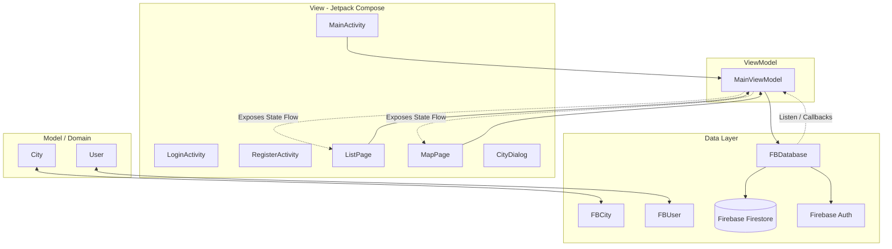

# WeatherApp - Documentação Oficial do Projeto

Este é um projeto acadêmico desenvolvido para a faculdade na disciplina de Programação para Dispositivos Móveis (PDM). O **WeatherApp** é um aplicativo Android desenvolvido em **Kotlin** com a interface gráfica construída inteiramente em **Jetpack Compose**. Ele faz uso do **Firebase** para autenticação e banco de dados em nuvem, e integra o **Google Maps** para exibição e gerenciamento dinâmico de cidades favoritas.

---

## 1. Visão Geral

O **WeatherApp** é um aplicativo móvel voltado para o cadastro e visualização de cidades e suas informações climáticas (simuladas ou em tempo real). O aplicativo resolve o problema de armazenamento e visualização espacial de locais de interesse do usuário, agrupando cidades favoritas em uma lista interativa e mapeando-as geograficamente.

O fluxo de uso básico compreende o login ou registro de um usuário. Uma vez autenticado, o usuário tem acesso a três telas principais por meio de uma barra de navegação inferior: uma página inicial com saudações, uma tela de listagem de cidades favoritas que permite a adição (por digitação de nome em um diálogo) e exclusão rápida, e uma tela de mapas integrada ao Google Maps.

No mapa, o aplicativo apresenta marcadores geográficos diferenciados por cores para três cidades fixas do Nordeste (Recife, Caruaru e João Pessoa), além de renderizar dinamicamente marcadores vermelhos normais em todas as cidades que o usuário marcou como favoritas. A adição de novas cidades favoritadas pode ser feita de maneira intuitiva com um único toque em qualquer coordenada do mapa, sincronizando automaticamente essa nova localização na nuvem em tempo real.

---

## 2. Arquitetura

O projeto adota o padrão de arquitetura **MVVM (Model-View-ViewModel)** recomendado pelo Google para o ecossistema Android moderno. Esta separação garante um código modular, mais fácil de testar, e isola as regras de negócio das particularidades da interface gráfica e do banco de dados.



### Componentes de Arquitetura:

1. **Model (Modelo - Domínio)**:
   Representado pelas classes básicas Kotlin no pacote `com.weatherapp.model`. São objetos de dados puros que descrevem as entidades de negócio do aplicativo:
   - [City](file:///home/rafael/Documentos/projetos/faculdade/pdm/WeatherApp/app/src/main/java/com/weatherapp/model/City.kt): Nome, clima e coordenadas de localização (`LatLng`).
   - [User](file:///home/rafael/Documentos/projetos/faculdade/pdm/WeatherApp/app/src/main/java/com/weatherapp/model/User.kt): Nome e e-mail.

2. **View (Visualização - UI)**:
   Desenvolvida de forma declarativa usando **Jetpack Compose**. Compreende as Activities ([MainActivity](file:///home/rafael/Documentos/projetos/faculdade/pdm/WeatherApp/app/src/main/java/com/weatherapp/MainActivity.kt), [LoginActivity](file:///home/rafael/Documentos/projetos/faculdade/pdm/WeatherApp/app/src/main/java/com/weatherapp/LoginActivity.kt), [RegisterActivity](file:///home/rafael/Documentos/projetos/faculdade/pdm/WeatherApp/app/src/main/java/com/weatherapp/RegisterActivity.kt)) e as páginas do aplicativo ([HomePage](file:///home/rafael/Documentos/projetos/faculdade/pdm/WeatherApp/app/src/main/java/com/weatherapp/ui/HomePage.kt), [ListPage](file:///home/rafael/Documentos/projetos/faculdade/pdm/WeatherApp/app/src/main/java/com/weatherapp/ui/ListPage.kt), [MapPage](file:///home/rafael/Documentos/projetos/faculdade/pdm/WeatherApp/app/src/main/java/com/weatherapp/ui/MapPage.kt)). A interface observa os estados do ViewModel e reage a eles, redesenhando a tela a cada atualização de dados.

3. **ViewModel (Modelo de Visualização)**:
   Encapsulado em [MainViewModel](file:///home/rafael/Documentos/projetos/faculdade/pdm/WeatherApp/app/src/main/java/MainViewModel.kt). Mantém o estado da tela (a lista reativa de cidades favoritas e informações do usuário logado) usando estados nativos do Compose (`mutableStateListOf` e `mutableStateOf`). Ele delega as ações de persistência à camada de dados.

4. **Data Layer (Camada de Dados)**:
   Gerenciada pela classe [FBDatabase](file:///home/rafael/Documentos/projetos/faculdade/pdm/WeatherApp/app/src/main/java/com/weatherapp/db/fb/FBDatabase.kt), que abstrai as operações de banco de dados NoSQL do Firebase Firestore e controle de autenticação do Firebase Auth. Esta classe escuta ativamente alterações nos documentos na nuvem e notifica o ViewModel de forma assíncrona. Também inclui as classes de dados de persistência ([FBCity](file:///home/rafael/Documentos/projetos/faculdade/pdm/WeatherApp/app/src/main/java/com/weatherapp/db/fb/FBCity.kt) e [FBUser](file:///home/rafael/Documentos/projetos/faculdade/pdm/WeatherApp/app/src/main/java/com/weatherapp/db/fb/FBUser.kt)) que servem para serializar e desserializar documentos do Firestore.

### Fluxo de Dados:
- **Fluxo de Atualização (Unidirecional / Reativo)**: Mudanças no Firestore disparam eventos em tempo real no `addSnapshotListener` configurado em `FBDatabase`. Este notifica o `MainViewModel` pelos callbacks de listener (`onCityAdded`, `onCityRemoved`). O `MainViewModel` altera seu estado de composição interno (`cities`), que força as telas `ListPage` e `MapPage` a executarem uma recomposição automática, atualizando os marcadores do mapa e a lista em tela.
- **Fluxo de Ação**: Quando o usuário interage com a UI (clique para remover cidade na lista ou clique no mapa para adicionar), a UI aciona uma função no `MainViewModel`. O ViewModel converte o modelo de domínio em modelo do Firebase e chama os métodos de persistência da classe `FBDatabase`. Esta classe escreve ou deleta o documento no Firebase Firestore.

---

## 3. Funcionalidades

O **WeatherApp** implementa as seguintes funcionalidades:

- **Autenticação de Usuários**:
  - **Login**: Autenticação com e-mail e senha por meio do Firebase Authentication, com botão para limpar campos e redirecionamento para registro.
  - **Registro**: Criação de novas credenciais com validação local (a senha deve coincidir nos dois campos). Armazena informações adicionais (nome) no banco do Firestore.
  - **Sessão Persistente**: O aplicativo mantém o usuário conectado. Caso abra o app com login ativo, é levado direto à tela principal.
  - **Desconexão (Logout)**: Botão de saída rápida na barra superior que limpa a sessão e envia o usuário de volta para a tela de login.

- **Favoritar Cidades**:
  - **Adição por Nome**: Um diálogo interativo que solicita o nome da cidade para cadastrá-la.
  - **Adição Dinâmica no Mapa**: Permite clicar em qualquer local do mapa e salvar aquela coordenada geográfica imediatamente como um favorito, gerando o nome no padrão `Cidade@latitude:longitude`.

- **Sincronização em Tempo Real (Real-time Cloud Sync)**:
  - Integração contínua com o Firebase Firestore. Toda cidade favoritada é associada ao UID exclusivo do usuário logado na coleção `/users/{uid}/cities`, impedindo que os dados vazem para outras contas e sincronizando instantaneamente com a nuvem.

- **Exibição de Lista de Favoritos**:
  - Uma lista construída com `LazyColumn` que mostra os nomes das cidades favoritas, status de clima (fixado inicialmente como "Carregando clima...") e botão em formato de "X" para remoção imediata.

- **Integração com Google Maps**:
  - Visualização de mapa utilizando a biblioteca Jetpack Compose Maps.
  - Exibe marcadores estáticos com cores distintas: **Recife** (Azul), **Caruaru** (Verde) e **João Pessoa** (Vermelho).
  - Exibe marcadores vermelhos padrão para todas as cidades favoritadas dinamicamente pelo usuário que possuem coordenadas geográficas válidas.

- **Permissões em Tempo de Execução**:
  - Solicitação automática de permissão para localização precisa (`ACCESS_FINE_LOCATION`) ao carregar a tela principal. Exibe o botão de centralizar o mapa no usuário se a permissão for concedida.

---

## 4. Estrutura de Pacotes

A organização de pacotes do projeto segue a estrutura padrão de código-fonte Android sob `app/src/main/java/`:

```
java/
│
├── MainViewModel.kt               # ViewModel principal do fluxo e a classe factory correspondente
│
└── com/weatherapp/
    ├── WeatherApp.kt              # Classe de Application - gerencia AuthStateListener global
    ├── MainActivity.kt            # Activity principal com Scaffold, TopAppBar, BottomNavBar e NavHost
    ├── LoginActivity.kt           # Activity da tela de autenticação por e-mail e senha
    ├── RegisterActivity.kt        # Activity da tela de cadastro de novos usuários
    │
    ├── model/                     # Modelos de domínio (estruturas puras Kotlin)
    │   ├── City.kt                # Dados de uma cidade (nome, clima, LatLng)
    │   └── User.kt                # Dados básicos do usuário logado (nome, e-mail)
    │
    ├── db/                        # Camada de comunicação com bancos de dados
    │   └── fb/                    # Subpacote específico para integrações com Firebase
    │       ├── FBDatabase.kt      # Interface com Firestore e Firebase Auth
    │       ├── FBCity.kt          # Modelo serializável para Cidades no Firestore e mapeador para City
    │       └── FBUser.kt          # Modelo serializável para Usuários no Firestore e mapeador para User
    │
    └── ui/                        # Camada de Apresentação (Interface do Usuário - Compose)
        ├── HomePage.kt            # Página com a tela inicial de boas-vindas
        ├── ListPage.kt            # Página com LazyColumn exibindo cidades favoritas
        ├── MapPage.kt             # Página que renderiza o Google Map e seus marcadores
        ├── CityDialog.kt          # Diálogo modal para inserção manual de nome de cidade
        │
        ├── nav/                   # Componentes de infraestrutura de navegação
        │   ├── Route.kt           # Definição das rotas tipadas (Home, List, Map)
        │   ├── BottomNavItem.kt   # Definição e ícones dos botões da barra inferior
        │   └── BottomNavBar.kt    # Composable que renderiza a barra de navegação inferior
        │   └── MainNavHost.kt     # Grafo de navegação associando as rotas às páginas Compose
        │
        └── theme/                 # Definições visuais de design do Compose (cores, fontes, etc.)
```

---

## 5. Principais Classes e Funções

### Pacote Raiz `java/`

#### [MainViewModel.kt](file:///home/rafael/Documentos/projetos/faculdade/pdm/WeatherApp/app/src/main/java/MainViewModel.kt)
- **Responsabilidade**: Gerenciar e expor os estados da lista de cidades favoritas (`cities`) e do usuário logado (`user`) para as páginas Compose da UI. Centralizar as chamadas de CRUD de dados delegando para o banco `FBDatabase`.
- **Assinatura principal**: `class MainViewModel(private val db: FBDatabase) : ViewModel(), FBDatabase.Listener`
- **Funções chave**:
  - `remove(city: City)`: Remove uma cidade favoritada enviando sua representação Firebase para o método do banco de dados.
  - `add(name: String, location: LatLng? = null)`: Adiciona uma nova cidade instanciando um objeto `City` e convertendo para `FBCity`.
  - `onUserLoaded(user: FBUser)`: Callback que recebe a representação do usuário logado no Firestore e atualiza o estado observável de UI com o modelo de domínio `User`.
  - `onCityAdded(city: FBCity)`: Callback que detecta uma nova cidade inserida no Firestore e a adiciona à lista reativa.
  - `onCityRemoved(city: FBCity)`: Callback que detecta a exclusão de uma cidade no Firestore e a remove da lista reativa.
- **Fábrica**: `class MainViewModelFactory(private val db: FBDatabase)` provê a injeção de dependência necessária da base de dados ao criar a instância da ViewModel.
- **Relacionamentos**: Interage diretamente com `FBDatabase` e é compartilhado entre a `MainActivity` e as telas filhas `ListPage`, `MapPage` e `HomePage`.

---

### Pacote `com.weatherapp.model`

#### [City.kt](file:///home/rafael/Documentos/projetos/faculdade/pdm/WeatherApp/app/src/main/java/com/weatherapp/model/City.kt)
- **Responsabilidade**: Representar a entidade de negócio de uma cidade.
- **Propriedades**: `name: String`, `weather: String?` (opcional), `location: LatLng?` (coordenada geográfica opcional).
- **Funções chave**:
  - `toFBCity()`: Função de conversão que mapeia o objeto do domínio atual para uma classe serializável `FBCity`, preenchendo os valores double de latitude e longitude caso o `LatLng` exista.

#### [User.kt](file:///home/rafael/Documentos/projetos/faculdade/pdm/WeatherApp/app/src/main/java/com/weatherapp/model/User.kt)
- **Responsabilidade**: Representar a entidade de domínio do usuário.
- **Propriedades**: `name: String`, `email: String`.

---

### Pacote `com.weatherapp.db.fb`

#### [FBDatabase.kt](file:///home/rafael/Documentos/projetos/faculdade/pdm/WeatherApp/app/src/main/java/com/weatherapp/db/fb/FBDatabase.kt)
- **Responsabilidade**: Abstrair e concentrar todas as transações feitas nos serviços Firebase (Auth e Firestore).
- **Interface Listener**: Define métodos de retorno (`onUserLoaded`, `onUserSignOut`, `onCityAdded`, `onCityUpdated`, `onCityRemoved`) que o ViewModel assina para escutar alterações.
- **Funções chave**:
  - Bloco `init`: Registra um `addAuthStateListener`. Ao detectar que o usuário logou, busca os detalhes deste na coleção `/users/{uid}` e em seguida registra um `addSnapshotListener` na subcoleção de cidades `/users/{uid}/cities` para escutar adições, atualizações e deleções em tempo real. Ao detectar logout, desativa o snapshot listener de cidades.
  - `register(user: FBUser)`: Salva as informações iniciais de cadastro do usuário na coleção `/users/{uid}`.
  - `add(city: FBCity)`: Escreve um documento do tipo cidade favorita na subcoleção `/users/{uid}/cities`, usando o próprio nome da cidade como chave primária de identificação do documento.
  - `remove(city: FBCity)`: Apaga o documento do favorito na subcoleção `/users/{uid}/cities` pelo nome.
- **Relacionamentos**: Injetado no ViewModel; utiliza o Firebase SDK para comunicação externa com a nuvem.

#### [FBCity.kt](file:///home/rafael/Documentos/projetos/faculdade/pdm/WeatherApp/app/src/main/java/com/weatherapp/db/fb/FBCity.kt)
- **Responsabilidade**: Mapear a estrutura que é salva ou lida diretamente nos documentos do Firestore (contendo campos double planos, já que o Firestore não serializa a classe `LatLng` nativamente sem tratamento).
- **Propriedades**: `name: String?`, `lat: Double?`, `lng: Double?`.
- **Funções chave**:
  - `toCity()`: Cria e retorna um objeto de domínio `City`. Caso `lat` e `lng` não sejam nulos, reconstrói o objeto `LatLng`.
  - Função utilitária global `City.toFBCity()` para converter do domínio para persistência.

#### [FBUser.kt](file:///home/rafael/Documentos/projetos/faculdade/pdm/WeatherApp/app/src/main/java/com/weatherapp/db/fb/FBUser.kt)
- **Responsabilidade**: Classe serializável para persistência das informações do usuário.
- **Propriedades**: `name: String?`, `email: String?`.
- **Funções chave**:
  - `toUser()`: Instancia a classe de domínio `User`.

---

### Pacote `com.weatherapp`

#### [WeatherApp.kt](file:///home/rafael/Documentos/projetos/faculdade/pdm/WeatherApp/app/src/main/java/com/weatherapp/WeatherApp.kt)
- **Responsabilidade**: Classe base da aplicação Android (`Application`). Gerencia de forma global as rotas e ciclos de atividades no momento do login e logout.
- **Funções chave**:
  - No método `onCreate()`, ativa o `addAuthStateListener` do Firebase Auth de forma persistente. Se o usuário estiver autenticado, executa `goToMain()`, caso contrário chama `goToLogin()`.
  - `goToMain()` e `goToLogin()`: Disparam intents explícitas com flags especiais (`FLAG_ACTIVITY_NEW_TASK`, `FLAG_ACTIVITY_CLEAR_TASK` e `FLAG_ACTIVITY_SINGLE_TOP`) para garantir que o fluxo de atividades seja limpo, impedindo que o botão de voltar retorne para telas de autenticação após o login.

#### [LoginActivity.kt](file:///home/rafael/Documentos/projetos/faculdade/pdm/WeatherApp/app/src/main/java/com/weatherapp/LoginActivity.kt)
- **Responsabilidade**: Interface do usuário para entrada de credenciais existentes.
- **Funções chave**:
  - Composable `LoginPage()`: Desenha os campos de e-mail e senha (este último usando `PasswordVisualTransformation`).
  - Lógica do botão Login: Aciona `signInWithEmailAndPassword` no Firebase e, em caso de erro, exibe um Toast de falha.
  - Lógica do botão Registrar: Abre `RegisterActivity` com flags que evitam recriação na pilha.

#### [RegisterActivity.kt](file:///home/rafael/Documentos/projetos/faculdade/pdm/WeatherApp/app/src/main/java/com/weatherapp/RegisterActivity.kt)
- **Responsabilidade**: Permitir o cadastro de novos usuários preenchendo Nome, E-mail e confirmando a senha.
- **Funções chave**:
  - Composable `RegisterPage()`: Monta o formulário de cadastro. Habilita o botão Registrar apenas quando todos os campos estiverem preenchidos e a senha coincidir com sua repetição.
  - Ao registrar com sucesso com `createUserWithEmailAndPassword`, instancia um `FBDatabase` secundário e envia o nome do usuário cadastrado na coleção de usuários do Firestore pelo método `FBDatabase().register()`.

#### [MainActivity.kt](file:///home/rafael/Documentos/projetos/faculdade/pdm/WeatherApp/app/src/main/java/com/weatherapp/MainActivity.kt)
- **Responsabilidade**: Activity principal do app após login concluído. Contém a estrutura de base da UI (Scaffold) e gerencia permissões de localização.
- **Funções chave**:
  - Inicializa o `FBDatabase` e o `MainViewModel`.
  - Desenha a `TopAppBar` exibindo o nome do usuário logado (recuperado do ViewModel) e um botão de logout que chama `Firebase.auth.signOut()`.
  - Renderiza o `FloatingActionButton` (FAB) de adicionar cidade, que fica visível apenas se a aba ativa na navegação for a lista de favoritos.
  - Lança o diálogo `CityDialog` se o usuário clicar no FAB.
  - Solicita a permissão `ACCESS_FINE_LOCATION` usando `rememberLauncherForActivityResult`.

---

### Pacote `com.weatherapp.ui`

#### [HomePage.kt](file:///home/rafael/Documentos/projetos/faculdade/pdm/WeatherApp/app/src/main/java/com/weatherapp/ui/HomePage.kt)
- **Responsabilidade**: Tela inicial de boas-vindas do app.
- **Funções chave**: Composable `HomePage()`. Exibe apenas um container centralizado simples com a palavra "Home" sobre um plano de fundo azul.

#### [ListPage.kt](file:///home/rafael/Documentos/projetos/faculdade/pdm/WeatherApp/app/src/main/java/com/weatherapp/ui/ListPage.kt)
- **Responsabilidade**: Exibir e gerenciar a lista de cidades favoritas do usuário.
- **Funções chave**:
  - Composable `ListPage()`: Observa `viewModel.cities` e renderiza cada uma usando uma `LazyColumn` performática.
  - Composable `CityItem()`: Exibe um ícone de favorito, o nome da cidade, a simulação do clima e o botão lateral de fechar (excluir). Ao clicar no botão fechar, chama `viewModel.remove(city)`.

#### [MapPage.kt](file:///home/rafael/Documentos/projetos/faculdade/pdm/WeatherApp/app/src/main/java/com/weatherapp/ui/MapPage.kt)
- **Responsabilidade**: Renderizar o mapa interativo do Google Maps e processar os marcadores.
- **Funções chave**:
  - Composable `MapPage()`: Desenha o elemento `GoogleMap` gerenciando estados de câmera via `rememberCameraPositionState()`.
  - Verifica localmente se a permissão `ACCESS_FINE_LOCATION` está ativa para habilitar o indicador de posição do usuário no mapa.
  - Renderiza três marcadores geográficos estáticos fixos (Recife, Caruaru, João Pessoa) com cores alteradas.
  - Mapeia a lista `viewModel.cities` para renderizar marcadores adicionais vermelhos para cada cidade com coordenadas cadastradas.
  - Captura cliques livres no mapa pelo callback `onMapClick` e cadastra uma nova cidade no ViewModel com as coordenadas clicadas no padrão: `"Cidade@lat:lng"`.

#### [CityDialog.kt](file:///home/rafael/Documentos/projetos/faculdade/pdm/WeatherApp/app/src/main/java/com/weatherapp/ui/CityDialog.kt)
- **Responsabilidade**: Modal em tela para entrada de texto manual.
- **Funções chave**: Composable `CityDialog()`. Fornece um campo de entrada `OutlinedTextField` para o nome da cidade e dispara o callback `onConfirm` quando o usuário clica em "OK".

---

### Pacote `com.weatherapp.ui.nav`

#### [Route.kt` / `BottomNavItem.kt](file:///home/rafael/Documentos/projetos/faculdade/pdm/WeatherApp/app/src/main/java/com/weatherapp/ui/nav/BottomNavItem.kt)
- **Responsabilidade**: Definir os identificadores tipados de rotas de navegação do Compose e suas respectivas descrições e ícones na interface.
- **Rotas**: `Route.Home`, `Route.List`, `Route.Map` (decorados com `@Serializable` para compatibilidade com o Navigation Compose moderno).
- **Itens de Menu**: `BottomNavItem.HomeButton` (Início), `BottomNavItem.ListButton` (Favoritos), `BottomNavItem.MapButton` (Mapa).

#### [BottomNavBar.kt](file:///home/rafael/Documentos/projetos/faculdade/pdm/WeatherApp/app/src/main/java/com/weatherapp/ui/nav/BottomNavBar.kt)
- **Responsabilidade**: Componente gráfico da barra de navegação inferior.
- **Funções chave**: `BottomNavBar()`. Controla qual aba está ativa comparando a rota atual com as rotas definidas e realiza a transição de telas via `navController.navigate()` com configurações de popUpTo para preservar estados.

#### [MainNavHost.kt](file:///home/rafael/Documentos/projetos/faculdade/pdm/WeatherApp/app/src/main/java/com/weatherapp/ui/nav/MainNavHost.kt)
- **Responsabilidade**: Montar a árvore de rotas vinculando as URLs tipadas aos seus respectivos Composables e injetar a instância compartilhada do `MainViewModel`.
- **Funções chave**: `MainNavHost()`.

---

## 6. Dependências Externas

O aplicativo gerencia suas dependências utilizando catálogos de versão centralizados no arquivo [libs.versions.toml](file:///home/rafael/Documentos/projetos/faculdade/pdm/WeatherApp/gradle/libs.versions.toml) e importados em [build.gradle.kts](file:///home/rafael/Documentos/projetos/faculdade/pdm/WeatherApp/app/build.gradle.kts).

| Biblioteca / SDK | Versão | Propósito no Projeto |
| :--- | :---: | :--- |
| **Firebase Auth** | `24.1.0` | Gerenciamento de cadastro, autenticação e login de usuários na nuvem. |
| **Firebase Firestore** | `26.3.0` | Banco de dados NoSQL para sincronizar as cidades favoritas dos usuários em tempo real. |
| **Google Maps SDK (play-services-maps)** | `20.0.0` | API nativa da Google que fornece acesso e renderização do Google Maps no Android. |
| **Google Location Services** | `21.3.0` | Recuperação das coordenadas geográficas e localização física do dispositivo do usuário. |
| **Google Maps Compose (maps-compose)** | `8.3.0` | Biblioteca de integração oficial do Google Maps otimizada para o Jetpack Compose. |
| **Navigation Compose** | `2.9.8` | Suporte a transições de tela e navegação estruturada de abas usando rotas type-safe. |
| **KotlinX Serialization JSON** | `1.11.0` | Mecanismo de serialização e desserialização de classes Kotlin para passar dados em rotas. |
| **Material Icons Extended** | - | Biblioteca estendida de ícones adicionais do Material 3. |
| **Lifecycle ViewModel Compose** | `2.10.0` | Vinculação e inicialização correta do ViewModel no ciclo de vida dos Composables. |

---

## 7. Configuração e Execução

### Pré-requisitos
1. **Android Studio** instalado (versão Ladybug ou superior).
2. **Java Development Kit (JDK) 17** ou superior instalado e configurado no Android Studio.
3. Um dispositivo Android físico conectado via USB com a Depuração USB ativada, ou um Emulador Android configurado.

### Passos de Configuração

#### 1. Clonar o projeto e abrir no Android Studio
Faça o download do código fonte e importe a pasta raiz do projeto no Android Studio. Aguarde a conclusão da primeira sincronização do Gradle.

#### 2. Configurar o Firebase
1. Vá até o [Firebase Console](https://console.firebase.google.com/).
2. Crie um novo projeto acadêmico.
3. Adicione um aplicativo Android ao projeto com o pacote correspondente: `com.weatherapp`.
4. Faça o download do arquivo `google-services.json` gerado pelo assistente do Firebase.
5. Copie e cole esse arquivo na pasta `/app` do projeto:
   - Caminho de destino: `/app/google-services.json`
6. No console do Firebase:
   - Ative o **Firebase Authentication** com o provedor de login por "E-mail/Senha".
   - Ative o **Cloud Firestore** em modo de teste (ou configure regras que permitam leitura/escrita sob a coleção `/users`).

#### 3. Configurar a Chave do Google Maps
1. Vá até o [Google Cloud Console](https://console.cloud.google.com/).
2. Crie ou selecione um projeto existente.
3. Vá em "APIs e Serviços" e ative o **Maps SDK for Android**.
4. Crie uma **Chave de API** em "Credenciais".
5. Na raiz do seu projeto Android (onde fica localizado o arquivo `settings.gradle.kts`), crie ou edite o arquivo chamado `local.properties`.
6. Adicione a seguinte propriedade no final do arquivo:
   ```properties
   MAPS_API_KEY=SUA_CHAVE_DE_API_DO_GOOGLE_MAPS
   ```
   *(Nota: O plugin Gradle `secrets-gradle-plugin` lerá essa variável e a injetará de forma segura nos metadados do aplicativo em tempo de compilação).*

### Compilação e Execução
No menu do topo do Android Studio, certifique-se de que o módulo `app` está selecionado e o seu emulador/dispositivo conectado está visível.
- Clique no botão **Run** (ícone do Play verde 🟢) ou use o atalho `Shift + F10`.
- Alternativamente, use a linha de comando no terminal da raiz do projeto para compilar e instalar:
  ```bash
  ./gradlew installDebug
  ```

---

## 8. Fluxo de Autenticação

O fluxo de telas e ciclo de autenticação do aplicativo funciona de forma contínua e assíncrona baseado no estado de login do Firebase Authentication. Ele é mapeado da seguinte maneira:

```
                  ┌──────────────────────┐
                  │   Início do App      │
                  │   (WeatherApp.kt)    │
                  └──────────┬───────────┘
                             │
                  [AuthStateListener]
                             │
                             ├─────────────────────────────────┐
                   (currentUser == null)              (currentUser != null)
                             │                                 │
                             ▼                                 ▼
                 ┌──────────────────────┐           ┌──────────────────────┐
                 │   LoginActivity      │           │    MainActivity      │
                 │    (Login Screen)    │           │    (Main App Screen) │
                 └─────┬──────────┬─────┘           └──────────┬───────────┘
                       │          │                            │
                       │     [Registrar]                       │
                       │          │                            │
                       │          ▼                            │
                       │  ┌──────────────┐                     │
             [Confirm] │  │RegisterActiv.│                     │
               Login   │  │(Regis. Screen)                     │
                       │  └──────┬───────┘                     │
                       │         │                             │
                       │    [Success]                          │
                       │         ├─────────────────────────────┘
                       │         │
                       ▼         ▼
                 ┌──────────────────────┐
                 │      MainActivity    │
                 │                      │
                 │   TopBar -> [Exit] ──┼──────────────────────┐
                 └──────────────────────┘                      │
                                                               │
                                                       [Auth SignOut]
                                                               │
                                                               ▼
                                                    ┌──────────────────────┐
                                                    │   LoginActivity      │
                                                    └──────────────────────┘
```

1. **Monitoramento Global**: A classe customizada [WeatherApp](file:///home/rafael/Documentos/projetos/faculdade/pdm/WeatherApp/app/src/main/java/com/weatherapp/WeatherApp.kt) registra um observador `addAuthStateListener` no Firebase Auth logo no seu início. Esse escutador roda em segundo plano durante toda a vida do processo do app.
2. **Entrada sem Sessão**: Se o usuário não está autenticado, o listener chama `goToLogin()`, que inicia a `LoginActivity` e limpa o histórico de telas anteriores da pilha.
3. **Fluxo de Login bem-sucedido**: O usuário insere suas credenciais e clica no botão "Login". O SDK do Firebase se comunica com a nuvem. Caso a credencial seja válida, a sessão é iniciada. O `AuthStateListener` percebe o login, dispara o callback e inicia a `MainActivity` chamando `goToMain()`.
4. **Fluxo de Cadastro**: O usuário pode clicar no botão "Registrar" na tela de login para ir à `RegisterActivity`. Quando preenche seus dados válidos e clica em "Registrar", o app chama o SDK para criar o login. Assim que o login é criado na nuvem, o aplicativo envia o nome do usuário cadastrado para o Firestore (`FBDatabase().register(...)`). O login bem-sucedido aciona o listener global, disparando o redirecionamento automático para a `MainActivity`.
5. **Fluxo de Desconexão (Logout)**: A qualquer momento na `MainActivity`, o usuário pode clicar no ícone de saída na barra superior (`TopAppBar`). Esse clique chama `Firebase.auth.signOut()`. O `AuthStateListener` na classe `WeatherApp` detecta a perda da sessão ativa, apaga o estado da lista no banco local de imediato e chama `goToLogin()`, redirecionando o usuário para a tela de login.

---

## 9. Fluxo do Mapa e Sincronização

A sincronização de favoritos entre a lista e o mapa utiliza o `MainViewModel` como fonte única de verdade dos dados (Single Source of Truth), com sincronização bidirecional na nuvem através do Firebase Firestore.

```
┌────────────────────────────────────────────────────────────────────────────┐
│                             Firebase Firestore                             │
│                     Coleção: /users/{uid}/cities/                          │
└──────────────────────────────────────┬─────────────────────────────────────┘
                                       │
                    [addSnapshotListener (Tempo Real)]
                                       │
                                       ▼
┌────────────────────────────────────────────────────────────────────────────┐
│                         FBDatabase (Data Layer)                            │
│                  - Listener.onCityAdded/Removed()                          │
└──────────────────────────────────────┬─────────────────────────────────────┘
                                       │
                             [Callback Triggers]
                                       │
                                       ▼
┌────────────────────────────────────────────────────────────────────────────┐
│                    MainViewModel (Observable State)                        │
│             - _cities (mutableStateListOf) -> cities: List                 │
└────────────────────────┬───────────────────────────┬───────────────────────┘
                         │                           │
              [State Recomposition]       [State Recomposition]
                         │                           │
                         ▼                           ▼
┌───────────────────────────────────┐     ┌──────────────────────────────────┐
│        ListPage (UI Screen)       │     │       MapPage (UI Screen)        │
│  - LazyColumn list items          │     │  - GoogleMap Composable          │
│  - Clique excluir -> remove()     │     │  - Clique mapa -> add()          │
└───────────────────────────────────┘     └──────────────────────────────────┘
```

1. **Carregamento dos Favoritos**:
   - Assim que o usuário faz login, a classe `FBDatabase` escuta em tempo real a subcoleção de favoritos (`/users/{uid}/cities`) no Firestore via snapshot listener.
   - Qualquer modificação (documento adicionado ou removido no banco) é capturada e encaminhada para o listener da `MainViewModel`.
   - O `MainViewModel` atualiza o objeto `_cities` que é um `mutableStateListOf<City>`.
   - As telas `ListPage` e `MapPage` leem essa lista em seus loops Compose. Consequentemente, uma adição de documento no Firebase gera automaticamente um novo marcador no mapa e um novo item de linha na lista física.

2. **Criação de Marcadores**:
   - **Marcadores Fixos**: No composable `MapPage`, três instâncias estáticas de marcador são declaradas e salvas em memória local (`Recife`, `Caruaru`, `João Pessoa`). Elas são desenhadas diretamente dentro da tag `GoogleMap` e recebem cores azul, verde e vermelha via constantes do SDK `BitmapDescriptorFactory`.
   - **Marcadores Dinâmicos**: O `MapPage` percorre toda a lista de `viewModel.cities` em tempo de desenho. Para cada cidade que possui coordenadas geográficas válidas (`LatLng`), o composable renderiza uma tag `Marker(state = MarkerState(position = city.location), title = city.name)`.

3. **Fluxo de Adição por Clique no Mapa**:
   - O componente `GoogleMap` possui o evento de escuta `onMapClick`.
   - Quando o usuário toca na tela do mapa em um ponto vazio, o mapa retorna as coordenadas exatas do toque (`it.latitude` e `it.longitude`).
   - O composable chama `viewModel.add(name = "Cidade@${it.latitude}:${it.longitude}", location = it)`.
   - O ViewModel instancia a entidade `City`, gera a conversão para `FBCity` (com campos double planos) e chama o banco de dados `db.add()`.
   - O método `add()` escreve esse favorito no Firestore no documento correspondente a `Cidade@latitude:longitude` sob o caminho `/users/{uid}/cities/Cidade@latitude:longitude`.
   - O Firestore atualiza o banco de dados em nuvem.
   - O listener de snapshots da `FBDatabase` detecta a inserção do documento no Firestore, decodifica para `FBCity`, chama `listener?.onCityAdded(fbCity)`.
   - O `MainViewModel` recebe o callback, reconverte de `FBCity` para `City` e insere na lista interna do estado observável `_cities`.
   - A alteração na lista de estados reativos causa a recomposição simultânea do mapa (mostrando o novo marcador vermelho na posição exata clicada) e da lista física de favoritos (inserindo a linha correspondente).

4. **Sincronização Lista-Mapa**:
   - Se o usuário navegar para a tela de Lista (`ListPage`) e clicar no ícone "X" (Close) de remoção ao lado de qualquer item, a lista aciona `viewModel.remove(city)`.
   - O ViewModel solicita que a base delete o documento correspondente pelo nome no Firestore.
   - O Firestore deleta o registro.
   - O SnapshotListener detecta o evento de deleção, notifica o ViewModel (`onCityRemoved`) e a cidade é excluída do estado `_cities`.
   - Ao voltar para a tela de Mapa, o marcador correspondente àquela cidade sumiu, estando os dados perfeitamente sincronizados através do ViewModel unificado.
